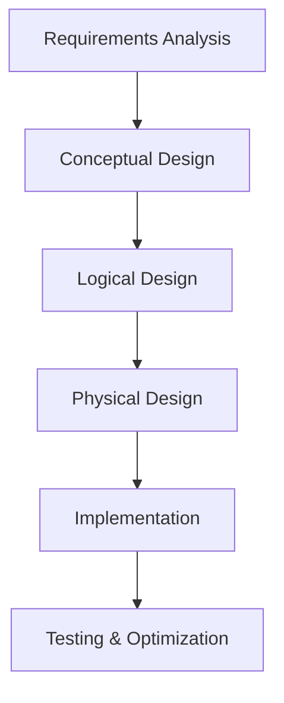

# Complete Database Schema Design Guide & Cheat Sheet

## Table of Contents
1. [Overview](#overview)
2. [Database Design Principles](#database-design-principles)
3. [Normalization Guide](#normalization-guide)
4. [Data Types Reference](#data-types-reference)
5. [Constraints and Relationships](#constraints-and-relationships)
6. [Indexing Strategy](#indexing-strategy)
7. [Schema Design Process](#schema-design-process)
8. [Common Schema Patterns](#common-schema-patterns)
9. [Performance Optimization](#performance-optimization)
10. [Security Considerations](#security-considerations)
11. [Quick Reference Templates](#quick-reference-templates)
12. [Best Practices Checklist](#best-practices-checklist)
13. [Troubleshooting Common Issues](#troubleshooting-common-issues)

---

## Overview

This guide provides a comprehensive reference for designing, implementing, and optimizing database schemas. Use it as your go-to resource for creating robust, scalable, and maintainable database structures.

### Key Design Goals
- **Data Integrity**: Ensure data accuracy and consistency
- **Performance**: Optimize for query speed and efficiency
- **Scalability**: Design for future growth
- **Maintainability**: Keep schema simple and well-documented
- **Security**: Protect sensitive data appropriately

---

## Database Design Principles

### 1. Entity-Relationship Modeling

#### Identify Entities
```
Entity: Real-world object or concept
Examples: User, Product, Order, Review, Payment
```

#### Define Relationships
```
One-to-One (1:1):    User ←→ Profile
One-to-Many (1:N):   User → Orders
Many-to-Many (M:N):  Students ←→ Courses (requires junction table)
```

#### Entity Attributes
```
- Primary Key: Unique identifier
- Foreign Key: Reference to another entity
- Required vs Optional attributes
- Data types and constraints
```

### 2. Database Design Process



---

## Normalization Guide

### First Normal Form (1NF)
**Rule**: Eliminate repeating groups and ensure atomic values

❌ **Violation Example**:
```sql
CREATE TABLE Customer (
    id INT,
    name VARCHAR(100),
    phones VARCHAR(500)  -- "123-456-7890, 098-765-4321"
);
```

✅ **Corrected**:
```sql
CREATE TABLE Customer (
    id INT PRIMARY KEY,
    name VARCHAR(100)
);

CREATE TABLE CustomerPhone (
    customer_id INT,
    phone VARCHAR(20),
    phone_type ENUM('home', 'work', 'mobile'),
    FOREIGN KEY (customer_id) REFERENCES Customer(id)
);
```

### Second Normal Form (2NF)
**Rule**: Must be in 1NF + no partial dependencies on composite keys

❌ **Violation Example**:
```sql
CREATE TABLE OrderItem (
    order_id INT,
    product_id INT,
    product_name VARCHAR(100),  -- Depends only on product_id
    quantity INT,
    PRIMARY KEY (order_id, product_id)
);
```

✅ **Corrected**:
```sql
CREATE TABLE Product (
    product_id INT PRIMARY KEY,
    product_name VARCHAR(100)
);

CREATE TABLE OrderItem (
    order_id INT,
    product_id INT,
    quantity INT,
    PRIMARY KEY (order_id, product_id),
    FOREIGN KEY (product_id) REFERENCES Product(product_id)
);
```

### Third Normal Form (3NF)
**Rule**: Must be in 2NF + no transitive dependencies

❌ **Violation Example**:
```sql
CREATE TABLE Employee (
    emp_id INT PRIMARY KEY,
    name VARCHAR(100),
    department_id INT,
    department_name VARCHAR(100)  -- Depends on department_id, not emp_id
);
```

✅ **Corrected**:
```sql
CREATE TABLE Department (
    department_id INT PRIMARY KEY,
    department_name VARCHAR(100)
);

CREATE TABLE Employee (
    emp_id INT PRIMARY KEY,
    name VARCHAR(100),
    department_id INT,
    FOREIGN KEY (department_id) REFERENCES Department(department_id)
);
```

---

## Data Types Reference

### MySQL Data Types

#### Numeric Types
```sql
-- Integers
TINYINT     -- 1 byte  (-128 to 127)
SMALLINT    -- 2 bytes (-32,768 to 32,767)
MEDIUMINT   -- 3 bytes (-8,388,608 to 8,388,607)
INT         -- 4 bytes (-2,147,483,648 to 2,147,483,647)
BIGINT      -- 8 bytes (very large range)

-- Decimal Numbers
DECIMAL(M,D)  -- Exact decimal (M=total digits, D=decimal places)
FLOAT(M,D)    -- Single precision floating point
DOUBLE(M,D)   -- Double precision floating point

-- Examples
price DECIMAL(10,2)        -- $99,999,999.99
latitude DECIMAL(10,8)     -- Precise coordinates
percentage FLOAT(5,2)      -- 100.99%
```

#### String Types
```sql
-- Fixed Length
CHAR(n)     -- Fixed length, padded with spaces

-- Variable Length
VARCHAR(n)  -- Variable length, up to n characters
TEXT        -- Up to 65,535 characters
MEDIUMTEXT  -- Up to 16,777,215 characters
LONGTEXT    -- Up to 4,294,967,295 characters

-- Binary
BLOB        -- Binary Large Object
MEDIUMBLOB  -- Medium binary data
LONGBLOB    -- Large binary data

-- Examples
user_id CHAR(36)           -- UUID
email VARCHAR(255)         -- Email address
description TEXT           -- Long description
profile_image MEDIUMBLOB   -- Image data
```

#### Date and Time Types
```sql
DATE        -- YYYY-MM-DD
TIME        -- HH:MM:SS
DATETIME    -- YYYY-MM-DD HH:MM:SS
TIMESTAMP   -- Auto-updating timestamp
YEAR        -- YYYY

-- Examples with defaults
created_at TIMESTAMP DEFAULT CURRENT_TIMESTAMP
updated_at TIMESTAMP DEFAULT CURRENT_TIMESTAMP ON UPDATE CURRENT_TIMESTAMP
birth_date DATE
event_time TIME
```

#### Special Types
```sql
-- Enumeration
ENUM('value1', 'value2', 'value3')

-- JSON (MySQL 5.7+)
JSON

-- Boolean (actually TINYINT(1))
BOOLEAN

-- Examples
status ENUM('active', 'inactive', 'pending')
metadata JSON
is_verified BOOLEAN DEFAULT FALSE
```

### PostgreSQL Specific Types
```sql
-- UUID
UUID

-- Arrays
INTEGER[]
TEXT[]

-- Network Types
INET        -- IP address
CIDR        -- Network address

-- Geometric Types
POINT       -- Point in 2D space
POLYGON     -- Polygon shape

-- Examples
user_id UUID DEFAULT gen_random_uuid()
tags TEXT[]
ip_address INET
location POINT
```

---

## Constraints and Relationships

### Primary Keys
```sql
-- Single column
CREATE TABLE User (
    id INT AUTO_INCREMENT PRIMARY KEY,
    email VARCHAR(255) UNIQUE NOT NULL
);

-- Composite primary key
CREATE TABLE OrderItem (
    order_id INT,
    product_id INT,
    quantity INT,
    PRIMARY KEY (order_id, product_id)
);

-- UUID primary key
CREATE TABLE Product (
    id CHAR(36) PRIMARY KEY DEFAULT (UUID()),
    name VARCHAR(255) NOT NULL
);
```

### Foreign Keys
```sql
-- Basic foreign key
CREATE TABLE Order (
    id INT PRIMARY KEY,
    customer_id INT,
    FOREIGN KEY (customer_id) REFERENCES Customer(id)
);

-- Foreign key with actions
CREATE TABLE Order (
    id INT PRIMARY KEY,
    customer_id INT,
    CONSTRAINT fk_order_customer
        FOREIGN KEY (customer_id) REFERENCES Customer(id)
        ON DELETE CASCADE          -- Delete orders when customer is deleted
        ON UPDATE CASCADE          -- Update order.customer_id when customer.id changes
);

-- Multiple foreign keys
CREATE TABLE Review (
    id INT PRIMARY KEY,
    product_id INT,
    user_id INT,
    rating INT,
    FOREIGN KEY (product_id) REFERENCES Product(id) ON DELETE CASCADE,
    FOREIGN KEY (user_id) REFERENCES User(id) ON DELETE CASCADE
);
```

### Check Constraints
```sql
-- Range check
CREATE TABLE Product (
    id INT PRIMARY KEY,
    price DECIMAL(10,2),
    rating DECIMAL(3,2),
    CONSTRAINT chk_price CHECK (price > 0),
    CONSTRAINT chk_rating CHECK (rating >= 0 AND rating <= 5)
);

-- String validation
CREATE TABLE User (
    id INT PRIMARY KEY,
    email VARCHAR(255),
    age INT,
    CONSTRAINT chk_email CHECK (email LIKE '%@%'),
    CONSTRAINT chk_age CHECK (age >= 0 AND age <= 150)
);

-- Complex business rules
CREATE TABLE Booking (
    id INT PRIMARY KEY,
    start_date DATE,
    end_date DATE,
    CONSTRAINT chk_booking_dates CHECK (end_date > start_date)
);
```

### Unique Constraints
```sql
-- Single column
CREATE TABLE User (
    id INT PRIMARY KEY,
    email VARCHAR(255) UNIQUE,
    username VARCHAR(50) UNIQUE
);

-- Composite unique constraint
CREATE TABLE Review (
    id INT PRIMARY KEY,
    product_id INT,
    user_id INT,
    rating INT,
    CONSTRAINT uk_user_product UNIQUE (user_id, product_id)  -- One review per user per product
);
```

### Not Null Constraints
```sql
CREATE TABLE User (
    id INT PRIMARY KEY,
    first_name VARCHAR(100) NOT NULL,
    last_name VARCHAR(100) NOT NULL,
    email VARCHAR(255) NOT NULL UNIQUE,
    phone VARCHAR(20) NULL,  -- Optional field
    created_at TIMESTAMP NOT NULL DEFAULT CURRENT_TIMESTAMP
);
```

---

## Indexing Strategy

### When to Create Indexes

✅ **Create indexes on**:
- Primary keys (automatic)
- Foreign keys
- Frequently searched columns
- Columns used in WHERE clauses
- Columns used in ORDER BY
- Columns used in JOINs

❌ **Avoid indexes on**:
- Small tables (< 1000 rows)
- Columns that change frequently
- Tables with high INSERT/UPDATE activity
- Very wide columns

### Index Types

#### Basic Index
```sql
-- Single column index
CREATE INDEX idx_user_email ON User(email);
CREATE INDEX idx_order_date ON Order(order_date);

-- Multi-column index (order matters!)
CREATE INDEX idx_user_name ON User(last_name, first_name);
CREATE INDEX idx_order_customer_date ON Order(customer_id, order_date);
```

#### Unique Index
```sql
CREATE UNIQUE INDEX idx_user_email ON User(email);
CREATE UNIQUE INDEX idx_product_sku ON Product(sku);
```

#### Partial Index (PostgreSQL)
```sql
-- Index only active records
CREATE INDEX idx_active_users ON User(email) WHERE status = 'active';
```

#### Functional Index
```sql
-- Case-insensitive search
CREATE INDEX idx_user_email_lower ON User(LOWER(email));

-- Date part extraction
CREATE INDEX idx_order_year ON Order(YEAR(order_date));
```

### Index Optimization Examples

```sql
-- Optimize for common queries
-- Query: SELECT * FROM Order WHERE customer_id = ? AND status = ?
CREATE INDEX idx_order_customer_status ON Order(customer_id, status);

-- Query: SELECT * FROM Product WHERE category = ? ORDER BY price
CREATE INDEX idx_product_category_price ON Product(category, price);

-- Query: SELECT * FROM User WHERE created_at BETWEEN ? AND ?
CREATE INDEX idx_user_created_at ON User(created_at);
```

---

## Schema Design Process

### Step 1: Requirements Analysis
```
1. Identify business requirements
2. List all entities and their attributes
3. Define relationships between entities
4. Identify constraints and business rules
5. Consider future scalability needs
```

### Step 2: Conceptual Design
```
1. Create Entity-Relationship Diagram (ERD)
2. Define primary keys for each entity
3. Identify foreign key relationships
4. Normalize to eliminate redundancy
5. Validate against business requirements
```

### Step 3: Logical Design
```sql
-- Example: E-commerce Schema

-- Users/Customers
CREATE TABLE User (
    user_id CHAR(36) PRIMARY KEY DEFAULT (UUID()),
    email VARCHAR(255) UNIQUE NOT NULL,
    password_hash VARCHAR(255) NOT NULL,
    first_name VARCHAR(100) NOT NULL,
    last_name VARCHAR(100) NOT NULL,
    phone VARCHAR(20),
    created_at TIMESTAMP DEFAULT CURRENT_TIMESTAMP,
    updated_at TIMESTAMP DEFAULT CURRENT_TIMESTAMP ON UPDATE CURRENT_TIMESTAMP
);

-- Product Categories
CREATE TABLE Category (
    category_id INT AUTO_INCREMENT PRIMARY KEY,
    name VARCHAR(100) NOT NULL,
    description TEXT,
    parent_id INT,
    FOREIGN KEY (parent_id) REFERENCES Category(category_id)
);

-- Products
CREATE TABLE Product (
    product_id CHAR(36) PRIMARY KEY DEFAULT (UUID()),
    category_id INT NOT NULL,
    name VARCHAR(255) NOT NULL,
    description TEXT,
    price DECIMAL(10,2) NOT NULL,
    stock_quantity INT NOT NULL DEFAULT 0,
    is_active BOOLEAN DEFAULT TRUE,
    created_at TIMESTAMP DEFAULT CURRENT_TIMESTAMP,
    updated_at TIMESTAMP DEFAULT CURRENT_TIMESTAMP ON UPDATE CURRENT_TIMESTAMP,
    FOREIGN KEY (category_id) REFERENCES Category(category_id),
    CONSTRAINT chk_price CHECK (price >= 0),
    CONSTRAINT chk_stock CHECK (stock_quantity >= 0)
);

-- Orders
CREATE TABLE Order (
    order_id CHAR(36) PRIMARY KEY DEFAULT (UUID()),
    user_id CHAR(36) NOT NULL,
    status ENUM('pending', 'processing', 'shipped', 'delivered', 'cancelled') DEFAULT 'pending',
    total_amount DECIMAL(10,2) NOT NULL,
    shipping_address TEXT NOT NULL,
    order_date TIMESTAMP DEFAULT CURRENT_TIMESTAMP,
    shipped_date TIMESTAMP NULL,
    delivered_date TIMESTAMP NULL,
    FOREIGN KEY (user_id) REFERENCES User(user_id),
    CONSTRAINT chk_total_amount CHECK (total_amount >= 0)
);

-- Order Items (Many-to-Many relationship)
CREATE TABLE OrderItem (
    order_id CHAR(36),
    product_id CHAR(36),
    quantity INT NOT NULL,
    unit_price DECIMAL(10,2) NOT NULL,
    PRIMARY KEY (order_id, product_id),
    FOREIGN KEY (order_id) REFERENCES Order(order_id) ON DELETE CASCADE,
    FOREIGN KEY (product_id) REFERENCES Product(product_id),
    CONSTRAINT chk_quantity CHECK (quantity > 0),
    CONSTRAINT chk_unit_price CHECK (unit_price >= 0)
);
```

### Step 4: Physical Design & Optimization
```sql
-- Add indexes for performance
CREATE INDEX idx_user_email ON User(email);
CREATE INDEX idx_product_category ON Product(category_id);
CREATE INDEX idx_product_active ON Product(is_active);
CREATE INDEX idx_order_user ON Order(user_id);
CREATE INDEX idx_order_status ON Order(status);
CREATE INDEX idx_order_date ON Order(order_date);
CREATE INDEX idx_orderitem_product ON OrderItem(product_id);

-- Composite indexes for common queries
CREATE INDEX idx_product_category_active ON Product(category_id, is_active);
CREATE INDEX idx_order_user_status ON Order(user_id, status);
```

---

## Common Schema Patterns

### 1. User Authentication
```sql
CREATE TABLE User (
    user_id CHAR(36) PRIMARY KEY DEFAULT (UUID()),
    email VARCHAR(255) UNIQUE NOT NULL,
    username VARCHAR(50) UNIQUE,
    password_hash VARCHAR(255) NOT NULL,
    salt VARCHAR(255),
    email_verified BOOLEAN DEFAULT FALSE,
    last_login TIMESTAMP,
    failed_login_attempts INT DEFAULT 0,
    locked_until TIMESTAMP NULL,
    created_at TIMESTAMP DEFAULT CURRENT_TIMESTAMP,
    updated_at TIMESTAMP DEFAULT CURRENT_TIMESTAMP ON UPDATE CURRENT_TIMESTAMP
);

CREATE TABLE UserSession (
    session_id CHAR(36) PRIMARY KEY,
    user_id CHAR(36) NOT NULL,
    ip_address VARCHAR(45),
    user_agent TEXT,
    expires_at TIMESTAMP NOT NULL,
    created_at TIMESTAMP DEFAULT CURRENT_TIMESTAMP,
    FOREIGN KEY (user_id) REFERENCES User(user_id) ON DELETE CASCADE
);
```

### 2. Audit Trail Pattern
```sql
CREATE TABLE UserAudit (
    audit_id CHAR(36) PRIMARY KEY DEFAULT (UUID()),
    user_id CHAR(36) NOT NULL,
    action ENUM('CREATE', 'UPDATE', 'DELETE') NOT NULL,
    old_values JSON,
    new_values JSON,
    changed_by CHAR(36),
    changed_at TIMESTAMP DEFAULT CURRENT_TIMESTAMP,
    ip_address VARCHAR(45),
    FOREIGN KEY (user_id) REFERENCES User(user_id),
    FOREIGN KEY (changed_by) REFERENCES User(user_id)
);
```

### 3. Soft Delete Pattern
```sql
CREATE TABLE Product (
    product_id CHAR(36) PRIMARY KEY DEFAULT (UUID()),
    name VARCHAR(255) NOT NULL,
    price DECIMAL(10,2) NOT NULL,
    deleted_at TIMESTAMP NULL,  -- NULL = active, timestamp = deleted
    created_at TIMESTAMP DEFAULT CURRENT_TIMESTAMP,
    updated_at TIMESTAMP DEFAULT CURRENT_TIMESTAMP ON UPDATE CURRENT_TIMESTAMP
);

-- Query active products
SELECT * FROM Product WHERE deleted_at IS NULL;

-- Query deleted products
SELECT * FROM Product WHERE deleted_at IS NOT NULL;
```

### 4. Polymorphic Associations
```sql
-- Comments can belong to Posts, Products, etc.
CREATE TABLE Comment (
    comment_id CHAR(36) PRIMARY KEY DEFAULT (UUID()),
    commentable_type VARCHAR(50) NOT NULL,  -- 'Post', 'Product', etc.
    commentable_id CHAR(36) NOT NULL,       -- ID of the related record
    user_id CHAR(36) NOT NULL,
    content TEXT NOT NULL,
    created_at TIMESTAMP DEFAULT CURRENT_TIMESTAMP,
    FOREIGN KEY (user_id) REFERENCES User(user_id),
    INDEX idx_commentable (commentable_type, commentable_id)
);
```

### 5. Tree Structure (Categories, Comments)
```sql
-- Adjacency List Model (simple but limited depth queries)
CREATE TABLE Category (
    category_id INT AUTO_INCREMENT PRIMARY KEY,
    name VARCHAR(100) NOT NULL,
    parent_id INT,
    level INT DEFAULT 0,
    sort_order INT DEFAULT 0,
    FOREIGN KEY (parent_id) REFERENCES Category(category_id)
);

-- Nested Set Model (complex updates but efficient queries)
CREATE TABLE CategoryNested (
    category_id INT AUTO_INCREMENT PRIMARY KEY,
    name VARCHAR(100) NOT NULL,
    lft INT NOT NULL,
    rgt INT NOT NULL,
    level INT DEFAULT 0,
    INDEX idx_nested_set (lft, rgt)
);
```

### 6. Tag System
```sql
CREATE TABLE Tag (
    tag_id INT AUTO_INCREMENT PRIMARY KEY,
    name VARCHAR(50) UNIQUE NOT NULL,
    slug VARCHAR(50) UNIQUE NOT NULL,
    created_at TIMESTAMP DEFAULT CURRENT_TIMESTAMP
);

CREATE TABLE PostTag (
    post_id CHAR(36),
    tag_id INT,
    PRIMARY KEY (post_id, tag_id),
    FOREIGN KEY (post_id) REFERENCES Post(post_id) ON DELETE CASCADE,
    FOREIGN KEY (tag_id) REFERENCES Tag(tag_id) ON DELETE CASCADE
);
```

---

## Performance Optimization

### Query Optimization Techniques

#### 1. Proper Indexing
```sql
-- Before: Slow query
SELECT * FROM Order WHERE customer_id = 123 AND order_date > '2024-01-01';

-- Create composite index
CREATE INDEX idx_order_customer_date ON Order(customer_id, order_date);
```

#### 2. Query Rewriting
```sql
-- Avoid SELECT *
-- Bad
SELECT * FROM User WHERE email = 'user@example.com';

-- Good
SELECT user_id, first_name, last_name FROM User WHERE email = 'user@example.com';

-- Use LIMIT for pagination
SELECT * FROM Product ORDER BY created_at DESC LIMIT 20 OFFSET 40;

-- Use EXISTS instead of IN for large subqueries
-- Bad
SELECT * FROM User WHERE user_id IN (SELECT user_id FROM Order WHERE total > 1000);

-- Good
SELECT * FROM User u WHERE EXISTS (SELECT 1 FROM Order o WHERE o.user_id = u.user_id AND o.total > 1000);
```

#### 3. Denormalization for Performance
```sql
-- Store calculated values for performance
CREATE TABLE OrderSummary (
    user_id CHAR(36) PRIMARY KEY,
    total_orders INT DEFAULT 0,
    total_amount DECIMAL(10,2) DEFAULT 0,
    last_order_date TIMESTAMP,
    avg_order_value DECIMAL(10,2) DEFAULT 0,
    FOREIGN KEY (user_id) REFERENCES User(user_id)
);

-- Update with triggers or application logic
```

### Database Partitioning
```sql
-- Partition by date (MySQL 8.0+)
CREATE TABLE OrderHistory (
    order_id CHAR(36),
    user_id CHAR(36),
    order_date DATE,
    total_amount DECIMAL(10,2),
    INDEX idx_order_date (order_date)
)
PARTITION BY RANGE (YEAR(order_date)) (
    PARTITION p2022 VALUES LESS THAN (2023),
    PARTITION p2023 VALUES LESS THAN (2024),
    PARTITION p2024 VALUES LESS THAN (2025),
    PARTITION p_future VALUES LESS THAN MAXVALUE
);
```

---

## Security Considerations

### 1. Sensitive Data Protection
```sql
-- Separate sensitive data
CREATE TABLE UserCredential (
    user_id CHAR(36) PRIMARY KEY,
    password_hash VARCHAR(255) NOT NULL,
    salt VARCHAR(255) NOT NULL,
    encryption_key VARCHAR(255),
    created_at TIMESTAMP DEFAULT CURRENT_TIMESTAMP,
    FOREIGN KEY (user_id) REFERENCES User(user_id) ON DELETE CASCADE
);

-- Use appropriate field lengths
CREATE TABLE UserPII (
    user_id CHAR(36) PRIMARY KEY,
    ssn_encrypted VARBINARY(255),  -- Encrypted sensitive data
    credit_card_last4 CHAR(4),     -- Only store last 4 digits
    FOREIGN KEY (user_id) REFERENCES User(user_id) ON DELETE CASCADE
);
```

### 2. Access Control
```sql
-- Role-based access
CREATE TABLE Role (
    role_id INT AUTO_INCREMENT PRIMARY KEY,
    name VARCHAR(50) UNIQUE NOT NULL,
    description TEXT
);

CREATE TABLE Permission (
    permission_id INT AUTO_INCREMENT PRIMARY KEY,
    name VARCHAR(100) UNIQUE NOT NULL,
    resource VARCHAR(50) NOT NULL,
    action VARCHAR(50) NOT NULL
);

CREATE TABLE RolePermission (
    role_id INT,
    permission_id INT,
    PRIMARY KEY (role_id, permission_id),
    FOREIGN KEY (role_id) REFERENCES Role(role_id) ON DELETE CASCADE,
    FOREIGN KEY (permission_id) REFERENCES Permission(permission_id) ON DELETE CASCADE
);

CREATE TABLE UserRole (
    user_id CHAR(36),
    role_id INT,
    granted_at TIMESTAMP DEFAULT CURRENT_TIMESTAMP,
    granted_by CHAR(36),
    PRIMARY KEY (user_id, role_id),
    FOREIGN KEY (user_id) REFERENCES User(user_id) ON DELETE CASCADE,
    FOREIGN KEY (role_id) REFERENCES Role(role_id) ON DELETE CASCADE
);
```

### 3. Data Validation
```sql
-- Input validation constraints
CREATE TABLE User (
    user_id CHAR(36) PRIMARY KEY DEFAULT (UUID()),
    email VARCHAR(255) NOT NULL,
    phone VARCHAR(20),

    -- Email validation
    CONSTRAINT chk_email_format CHECK (email REGEXP '^[A-Za-z0-9._%+-]+@[A-Za-z0-9.-]+\.[A-Za-z]{2,}$'),

    -- Phone validation (basic)
    CONSTRAINT chk_phone_format CHECK (phone IS NULL OR phone REGEXP '^[0-9+()-\s]+$'),

    -- Prevent common injection attempts in varchar fields
    CONSTRAINT chk_no_html CHECK (email NOT LIKE '%<%' AND email NOT LIKE '%>%')
);
```

---

## Quick Reference Templates

### Basic Table Template
```sql
CREATE TABLE TableName (
    id CHAR(36) PRIMARY KEY DEFAULT (UUID()),
    name VARCHAR(255) NOT NULL,
    description TEXT,
    status ENUM('active', 'inactive') DEFAULT 'active',
    created_at TIMESTAMP DEFAULT CURRENT_TIMESTAMP,
    updated_at TIMESTAMP DEFAULT CURRENT_TIMESTAMP ON UPDATE CURRENT_TIMESTAMP,

    -- Indexes
    INDEX idx_name (name),
    INDEX idx_status (status),
    INDEX idx_created_at (created_at)
);
```

### Junction Table Template (Many-to-Many)
```sql
CREATE TABLE Entity1Entity2 (
    entity1_id CHAR(36),
    entity2_id CHAR(36),

    -- Additional attributes if needed
    created_at TIMESTAMP DEFAULT CURRENT_TIMESTAMP,
    created_by CHAR(36),

    -- Primary key
    PRIMARY KEY (entity1_id, entity2_id),

    -- Foreign keys
    FOREIGN KEY (entity1_id) REFERENCES Entity1(id) ON DELETE CASCADE,
    FOREIGN KEY (entity2_id) REFERENCES Entity2(id) ON DELETE CASCADE,
    FOREIGN KEY (created_by) REFERENCES User(id)
);
```

### Audit Table Template
```sql
CREATE TABLE TableNameAudit (
    audit_id CHAR(36) PRIMARY KEY DEFAULT (UUID()),
    table_name VARCHAR(50) NOT NULL,
    record_id CHAR(36) NOT NULL,
    action ENUM('INSERT', 'UPDATE', 'DELETE') NOT NULL,
    old_values JSON,
    new_values JSON,
    changed_by CHAR(36),
    changed_at TIMESTAMP DEFAULT CURRENT_TIMESTAMP,
    ip_address VARCHAR(45),
    user_agent TEXT,

    INDEX idx_table_record (table_name, record_id),
    INDEX idx_changed_at (changed_at),
    FOREIGN KEY (changed_by) REFERENCES User(id)
);
```

---

## Best Practices Checklist

### ✅ Design Phase
- [ ] All tables have primary keys
- [ ] Foreign key relationships are properly defined
- [ ] Schema is normalized to at least 3NF
- [ ] Business rules are enforced with constraints
- [ ] Naming conventions are consistent
- [ ] Data types are appropriate for the data
- [ ] Required vs optional fields are clearly defined

### ✅ Performance Phase
- [ ] Indexes created on foreign keys
- [ ] Indexes created on frequently queried columns
- [ ] Composite indexes for multi-column queries
- [ ] No unnecessary indexes on small tables
- [ ] Query patterns analyzed and optimized

### ✅ Security Phase
- [ ] Sensitive data is properly protected
- [ ] Input validation constraints in place
- [ ] Access control mechanisms implemented
- [ ] Audit trails for sensitive operations
- [ ] No plain text passwords stored

### ✅ Maintenance Phase
- [ ] Schema is well documented
- [ ] Migration scripts are version controlled
- [ ] Backup and recovery procedures tested
- [ ] Monitoring and alerting in place
- [ ] Regular performance reviews scheduled

---

## Troubleshooting Common Issues

### Issue: Slow Queries
```sql
-- Check query execution plan
EXPLAIN SELECT * FROM Order WHERE customer_id = 123;

-- Common solutions:
-- 1. Add index on customer_id
CREATE INDEX idx_order_customer ON Order(customer_id);

-- 2. Rewrite query to use existing indexes
-- 3. Consider denormalization for frequently accessed data
```

### Issue: Deadlocks
```sql
-- Always access tables in the same order
-- Bad: Transaction 1 locks User then Order, Transaction 2 locks Order then User

-- Good: Both transactions lock User first, then Order
BEGIN;
SELECT * FROM User WHERE id = ? FOR UPDATE;
SELECT * FROM Order WHERE customer_id = ? FOR UPDATE;
-- ... perform operations
COMMIT;
```

### Issue: Foreign Key Constraints
```sql
-- Check for orphaned records before adding constraints
SELECT DISTINCT customer_id FROM Order
WHERE customer_id NOT IN (SELECT id FROM Customer);

-- Clean up orphaned records
DELETE FROM Order WHERE customer_id NOT IN (SELECT id FROM Customer);

-- Then add the constraint
ALTER TABLE Order
ADD CONSTRAINT fk_order_customer
FOREIGN KEY (customer_id) REFERENCES Customer(id);
```

### Issue: Data Type Mismatches
```sql
-- Ensure consistent data types across related columns
-- Bad: User.id is INT but Order.customer_id is VARCHAR

-- Good: Both are the same type
ALTER TABLE Order MODIFY customer_id INT;
```

### Issue: Index Not Being Used
```sql
-- Check if function calls prevent index usage
-- Bad (doesn't use index on email)
SELECT * FROM User WHERE UPPER(email) = 'USER@EXAMPLE.COM';

-- Good (uses index)
SELECT * FROM User WHERE email = 'user@example.com';

-- Or create functional index
CREATE INDEX idx_user_email_upper ON User(UPPER(email));
```

---

## Conclusion

This guide provides a comprehensive foundation for database schema design. Remember:

1. **Start with requirements** - understand the business needs
2. **Design for the future** - plan for scalability and change
3. **Optimize iteratively** - don't over-optimize prematurely
4. **Document everything** - your future self will thank you
5. **Test thoroughly** - validate performance and data integrity

Keep this guide handy as your reference for future schema design projects!

---

*Last updated: August 2025*
*Version: 1.0*
